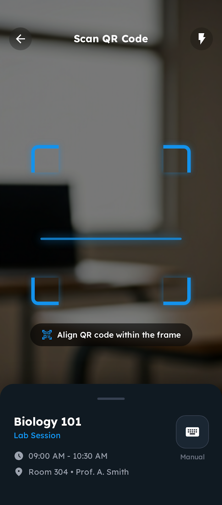
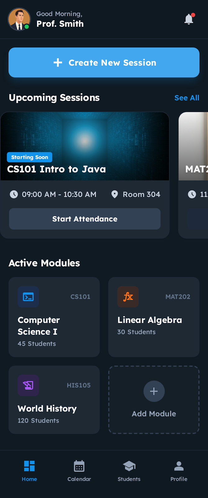
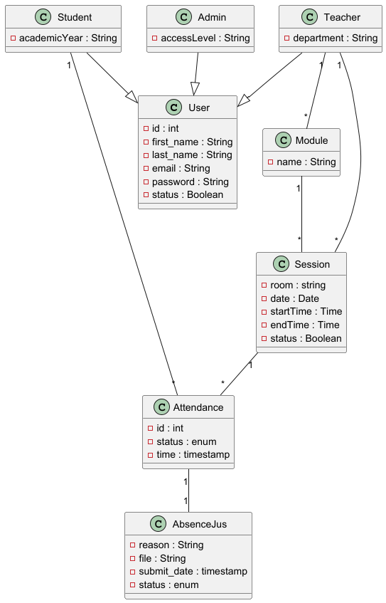

# 🎓 Student Attendance System (REST API)

A robust backend solution for managing student attendance, built with Django Rest Framework. This system is designed to power mobile applications, providing secure authentication, real-time statistics, and seamless attendance tracking.

---

## 📸 Mobile UI Preview


| Student Dashboard | QR Scanner | Teacher Dashboard |
| :---: | :---: | :---: |
|  |  |  |

---

## 🏗️ System Architecture

The project follows a structured software engineering approach with clear entity relationships and defined user roles.

### 1. Class Diagram



### 2. Use Case Diagram


---

## 🛠️ Tech Stack

* **Backend Framework:** Django & Django Rest Framework (DRF)
* **Authentication:** Simple JWT (Access & Refresh Tokens)
* **Database:**  PostgreSQL compatible
* **Architecture:** RESTful API with Role-Based Access Control (RBAC)

---

## 🚀 Key Features

* **🔒 Secure Auth:** JWT-based login/logout system with Token Blacklisting for enhanced security.
* **📊 Composite Dashboard:** A single endpoint providing overall attendance rates, warnings, and daily schedules to minimize mobile network requests.
* **👨‍🏫 Instructor Management:** Dedicated views for teachers to manage their specific modules and track student participation.
* **📂 Absence Justification:** System for students to upload files and reasons for missed sessions for teacher approval.
* **🕒 Real-time Session Tracking:** Logic to identify "Live Now" sessions vs. upcoming or past classes.

---

## 🛣️ API Endpoints Summary

https://documenter.getpostman.com/view/45514706/2sBXVkCphd
---

## ⚙️ Setup & Installation

1.  **Clone the project:**
    ```bash
    git clone [your-repository-link]
    cd Django_app
    ```

2.  **Activate Virtual Environment:**
    ```bash
    # On Windows:
    .\venv\Scripts\activate
    # On Mac/Linux:
    source venv/bin/activate
    ```

3.  **Install Requirements:**
    ```bash
    pip install -r requirements.txt
    ```

4.  **Run Migrations:**
    ```bash
    python manage.py migrate
    ```

5.  **Start the Development Server:**
    ```bash
    python manage.py runserver
    ```

---

## 🤝 Collaboration
I am open to improvements and new ideas! **I am happy with any collaboration** to make this project even better. Feel free to fork the repo, open issues, or submit pull requests.
